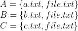
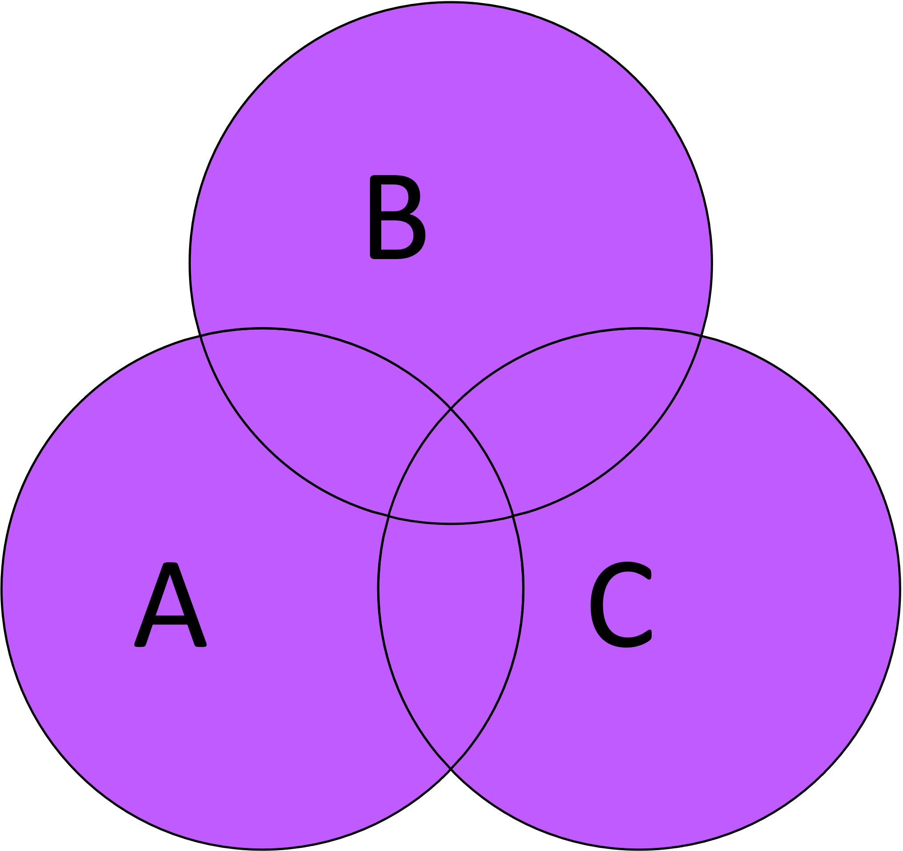
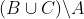

Set Operations on File Directories.

Use some basic Set Operations to analyse and compare the file names in 2 or more given directories.

# Background
Several times over the past couple of years I've had to work out the difference between 2 folders in terms of files.

Each time it's manually looking > unix utilies > ad-hoc scripts.

This little tool should permanently solve this problem.


# Install
```
pip3 install file-dir-set-ops --upgrade
```


# Usage
## Data


## Union



(In **A** OR **B** OR **C**)
```
file-dir-set-ops --operation union --dir-paths tests/data/a tests/data/b tests/data/c

a.txt
b.txt
c.txt
file.txt
```

## Intersection
  
(In **A** AND **B** AND **C**)
```
file-dir-set-ops --operation intersection --dir-paths tests/data/a tests/data/b tests/data/c

file.txt
```

## Relative Complement (Set Difference)
  
(In **A** AND Not in **B** OR **C**)
```
file-dir-set-ops --operation complement --dir-paths tests/data/a tests/data/b tests/data/c

a.txt
```


# Resources
* Set Theory: https://en.wikipedia.org/wiki/Set_theory
* Union: https://en.wikipedia.org/wiki/Union_(set_theory)
* Intersection: https://en.wikipedia.org/wiki/Intersection_(set_theory)
* (Relative) Complement: https://en.wikipedia.org/wiki/Complement_(set_theory)
* Python Sets: https://realpython.com/python-sets
* https://www.codecogs.com/latex/eqneditor.php
